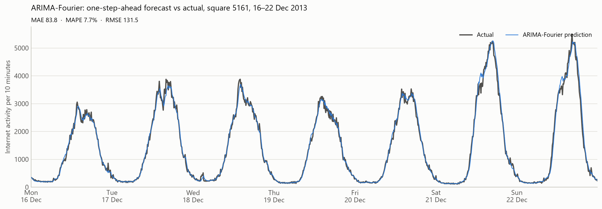
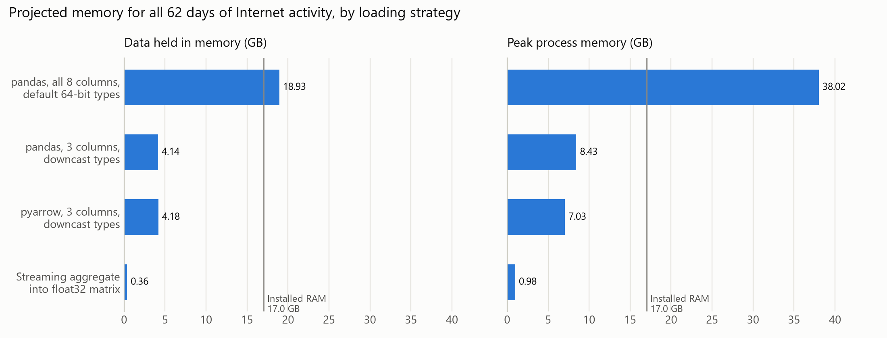
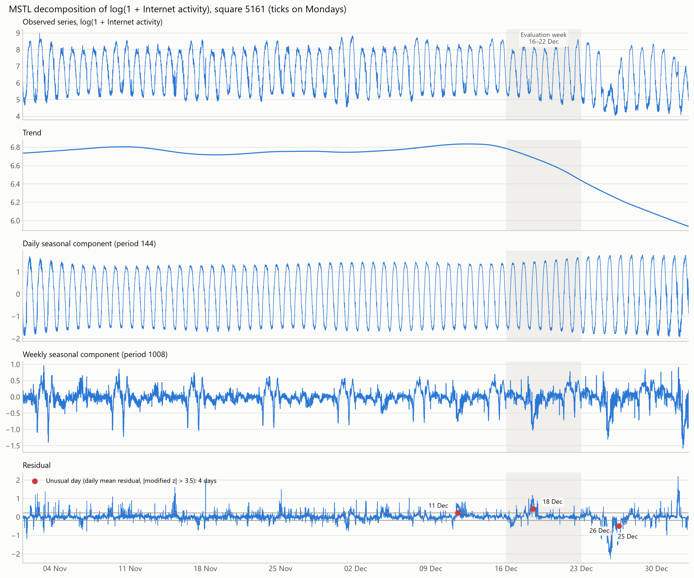
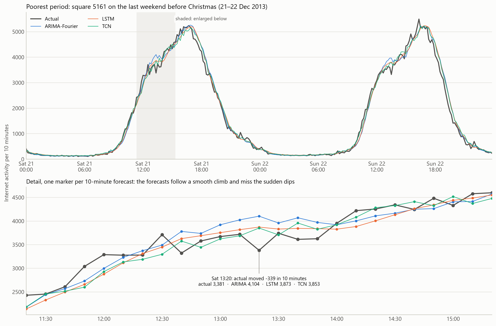

# Milan Mobile Internet Traffic Forecasting

A comparison of sequential models for **one-step-ahead forecasting of mobile Internet activity**
(the next 10 minutes) on the Telecom Italia *Big Data Challenge* grid of Milan: 10,000 squares,
10-minute intervals, 1 November 2013 – 1 January 2014.

> **Research question.** How do different sequential models compare for one-step-ahead mobile
> network traffic forecasting, and how does their performance vary across geographical areas with
> different traffic characteristics?



## Key findings

- **ARIMA with Fourier seasonal terms is the most accurate model in all three areas** (test MAE
  83.8, 66.6 and 62.9), ahead of a TCN and an LSTM, and it trains about four times faster.
- **The neural networks lost ground on unseen data.** On the validation week ARIMA and the TCN were
  within 0.6%; on the test week ARIMA was clearly ahead, and the TCN's accuracy varied widely
  between random seeds.
- **The largest errors are under-reactions.** In every area and for every model, 94–100% of the
  largest 5% of errors come from sharp 10-minute changes that the forecast fell short of.

## Contents

- [Repository structure](#repository-structure)
- [Setup](#setup)
- [Running the pipeline](#running-the-pipeline)
- [1. Data handling and memory](#1-data-handling-and-memory)
- [2. Exploratory analysis](#2-exploratory-analysis)
- [3. Models and hyperparameter tuning](#3-models-and-hyperparameter-tuning)
- [4. Evaluation](#4-evaluation)
- [Reproducibility](#reproducibility)
- [References](#references)

## Repository structure

```
milan-traffic-forecasting/
├── configs/
│   └── final_models.json        settings chosen by the tuning experiments
├── scripts/                     the pipeline, run in numbered order
│   ├── 01_build_dataset.py
│   ├── 02_memory_benchmark.py
│   ├── 03_exploratory_analysis.py
│   ├── 04_decomposition_experiment.py
│   ├── 05_tuning_experiment.py
│   ├── 06_evaluate_models.py
│   └── 07_failure_analysis.py
├── src/milan_forecasting/       the installable package
│   ├── config.py                paths, dataset constants, study design
│   ├── plotting.py              shared figure style
│   ├── system_info.py           hardware description for timing reports
│   ├── data/                    streaming loader and memory measurement
│   ├── analysis/                exploratory statistics and figures
│   └── forecasting/
│       ├── preprocessing.py     splits, log-standardisation, sliding windows
│       ├── metrics.py           MAE, RMSE, MAPE, MASE
│       ├── models/              baseline and ARIMA-Fourier (statistical.py), LSTM and TCN (neural.py)
│       ├── pipeline.py          fits and scores any model on identical data
│       ├── evaluation.py        repeated runs, results tables, timing summaries
│       ├── diagnostics.py       failure-analysis statistics
│       └── figures.py           forecast and failure-analysis figures
├── tests/                       27 unit tests
├── results/                     every output, grouped by report section
│   ├── 1_data_handling/
│   ├── 2_exploratory_analysis/
│   ├── 3_hyperparameter_tuning/
│   └── 4_model_evaluation/
│       ├── forecasts/           9 forecast plots and the test-week predictions
│       └── failure_analysis/
├── pyproject.toml
└── requirements.txt
```

## Setup

Tested with Python 3.14 on Windows 10, CPU only.

```bash
python -m venv .venv
# Windows: .venv\Scripts\activate    macOS/Linux: source .venv/bin/activate
pip install -e ".[dev]"      # the package, its pinned dependencies and pytest
python -m pytest             # 27 tests, about 15 seconds
```

The package must be installed in editable mode (`-e`), because it locates `data/`, `configs/` and
`results/` relative to the repository.

**Data.** Download the *Telecommunications – SMS, Call, Internet – MI* files from Harvard Dataverse
(doi:10.7910/DVN/EGZHFV) and extract the 62 daily files (`sms-call-internet-mi-YYYY-MM-DD.txt`,
about 20.8 GB) anywhere on disk. They do not need to be copied into the repository; pass the folder
with `--raw-dir` or set `MILAN_RAW_DIR`.

## Running the pipeline

Run from the repository root. Times are for the hardware described under [Evaluation](#4-evaluation).

| Step | Command | Time | Writes to |
|---|---|---|---|
| 1 | `python scripts/01_build_dataset.py --raw-dir <dir>` | 1.5 min | `data/processed/`, `results/1_data_handling/` |
| 2 | `python scripts/02_memory_benchmark.py --raw-dir <dir>` | 2 min | `results/1_data_handling/` |
| 3 | `python scripts/03_exploratory_analysis.py` | 6 min | `results/2_exploratory_analysis/` |
| 4 | `python scripts/04_decomposition_experiment.py` | 5 min | `results/2_exploratory_analysis/` |
| 5 | `python scripts/05_tuning_experiment.py --model <m> --params '<json>' --note "<why>"` | 1–60 min per run | `results/3_hyperparameter_tuning/` |
| 6 | `python scripts/06_evaluate_models.py` | 70 min | `results/4_model_evaluation/` |
| 7 | `python scripts/07_failure_analysis.py` | seconds | `results/4_model_evaluation/failure_analysis/` |

Steps 3–7 only need the processed dataset from step 1. Step 5 is run once per experiment and never
touches the test week; step 7 reuses the predictions saved by step 6.

## 1. Data handling and memory

The raw files hold one row per *(square, interval, caller country)* across eight columns, about
4.8 million rows a day. Forecasting needs only Internet activity per square and interval, so the
pipeline:

1. reads only `square_id`, `time_interval` and `internet`, with compact types (`int16`, `int64`,
   `float32`: 14 bytes per row instead of 64), using pyarrow's multithreaded reader;
2. sums each day's rows over country codes and writes them into a preallocated
   10,000 × 8,928 `float32` matrix (357 MB), holding only one day in memory at a time;
3. saves the matrix as `.npy`, which later steps open memory-mapped, loading only the rows they use.

Measured on a 3-day sample in isolated processes and projected to all 62 days:

| Strategy | Data in memory | Peak process memory |
|---|---|---|
| pandas, all 8 columns, default types | 18.9 GB | 38.0 GB |
| pandas, 3 columns, compact types | 4.1 GB | 8.4 GB |
| pyarrow, 3 columns, compact types | 4.2 GB | 7.0 GB |
| **Streaming into a `float32` matrix** | **0.36 GB** | **0.98 GB** (full build measured at 0.96 GB) |

Reading one square's series peaks at 478 MB when the matrix is loaded, versus 121 MB when it is
memory-mapped.



## 2. Exploratory analysis

- **Traffic is highly concentrated.** Area totals are close to log-normal (skewness 4.26, or 0.02
  after taking logs); the busiest 10% of squares carry 48% of all traffic (Gini 0.61), clustered in
  the city centre.
- **Areas differ in character.** Over the whole period, square 5161 is busier at weekends (1.38× its
  weekday level) and peaks mid-afternoon; 5259 behaves like an office district (weekends at 0.43×);
  4556 peaks at 22:00.
- **Strong, regular seasonality.** Autocorrelation is 0.99 at 10 minutes, 0.88 at one day and 0.84
  at one week; the partial autocorrelation cuts off after about two lags.
- **Seasonality is multiplicative,** so the series is modelled on the log scale: daily swings
  correlate 0.92 with the daily level, and taking logs cuts the hour-to-hour spread of decomposition
  residuals from 17× to 1.9×.
- **Decomposition** (robust MSTL on log traffic) gives seasonal strengths of 0.95 (daily) and 0.45
  (weekly). The level falls from mid-December into Christmas, and four days stand out: 25 and 26
  December (far below the pattern) and 11 and 18 December (above it, the latter inside the test
  week). `04_decomposition_experiment.py` shows why robust fitting was used: the default fit
  absorbed about a quarter of the Christmas dip into its components.
- **Stationarity.** ADF rejects a unit root and KPSS does not reject level stationarity, but their
  lag windows cover only 6 and 9 hours, so neither addresses the daily cycle or the holiday level
  shift.



## 3. Models and hyperparameter tuning

**Set-up.** Train 1 Nov – 8 Dec, validation 9–15 Dec, test 16–22 Dec 2013 (Milan time). Inputs are
`log(1 + x)` standardised with training statistics; each target is predicted from values strictly
before it, and errors are measured on the original scale.

| Model | Family | Final configuration |
|---|---|---|
| Seasonal naive | baseline | value at the same time on the previous day |
| **ARIMA-Fourier** | statistical | ARIMA(2,1,1) errors around 16 daily and 8 weekly Fourier pairs |
| **LSTM** | recurrent | 1 layer of 64 units, one-day window, Adam 5e-4, early stopping |
| **TCN** | convolutional | 6 dilated causal levels, 16 channels, kernel 3, dropout 0.1, one-day window |

The three models come from different families so the comparison is not between variants of one
architecture: a linear model with explicit seasonality, a recurrent network and a convolutional one.

**Tuning** used the validation week of square 5161 only, changing one setting per run and recording
the reasoning (15 runs in `results/3_hyperparameter_tuning/experiment_log.csv`). A model's tuning
stopped once a change improved validation MAE by less than 1%. Notable results:

- Smaller networks did better: halving the TCN's channels improved it, and a second LSTM layer made
  it worse.
- A one-week input window did not beat a one-day window for either network, at up to 28× the cost.
- One ARIMA fit failed with zero optimiser iterations because the 7th weekly harmonic duplicates the
  1st daily one (1,008 = 7 × 144). Duplicated harmonics are now removed; the failure and the fix are
  both in the log.

## 4. Evaluation

Test week 16–22 December, never used during tuning. Networks: mean ± standard deviation over seeds
42, 7 and 123. Full tables are in `results/4_model_evaluation/results_tables.md`.

| Square | Model | MAE | MAPE (%) | RMSE |
|---|---|---|---|---|
| 5161 | Seasonal naive | 338.59 | 25.94 | 619.04 |
| | **ARIMA-Fourier** | **83.79** | **7.74** | **131.54** |
| | LSTM | 92.53 ± 1.94 | 8.48 ± 0.04 | 144.31 ± 3.12 |
| | TCN | 87.74 ± 0.69 | 8.60 ± 0.63 | 132.10 ± 3.52 |
| 5059 | Seasonal naive | 171.74 | 18.02 | 245.87 |
| | **ARIMA-Fourier** | **66.56** | **6.43** | **97.25** |
| | LSTM | 69.58 ± 2.41 | 6.72 ± 0.24 | 102.17 ± 3.76 |
| | TCN | 73.31 ± 4.75 | 7.50 ± 0.99 | 104.32 ± 4.68 |
| 5259 | Seasonal naive | 470.32 | 71.62 | 861.62 |
| | **ARIMA-Fourier** | **62.91** | **6.79** | **92.23** |
| | LSTM | 66.63 ± 0.33 | 7.24 ± 0.11 | 96.00 ± 1.44 |
| | TCN | 68.86 ± 9.80 | 7.24 ± 0.39 | 103.54 ± 20.31 |

**Timing** on an Intel Core i5-7200U (2 cores / 4 threads), 17.0 GB RAM, no GPU, PyTorch on 2
threads. Median and range over 9 measurements across the three squares; the method is recorded in
`results/4_model_evaluation/timing.json`.

| Model | Training time | Prediction time per forecast |
|---|---|---|
| ARIMA-Fourier | 53 s (31–61 s) | 0.13 ms |
| LSTM | 190 s (112–282 s) | 0.19 ms |
| TCN | 222 s (129–497 s) | 0.14 ms |

**Failure analysis.** The weakest period is the last weekend before Christmas in square 5161, when
traffic peaked about 50% above weekday levels. Across all areas and models, 94–100% of the largest
5% of errors are under-reactions to a sharp 10-minute change, and error size correlates 0.58–0.72
with the size of that change.



## Reproducibility

- Neural networks use fixed seeds; the same seed and data give identical results.
- ARIMA and the baseline are deterministic; their repeated runs only measure time.
- Timings on a laptop vary between runs (an identical TCN run took 300 s and 493 s), which is why
  medians over repeated measurements are reported.
- `python -m pytest` checks the data pipeline, statistics, models (including that forecasts never
  use later values) and the evaluation helpers.

## References

1. G. Barlacchi *et al.*, "A multi-source dataset of urban life in the city of Milan and the Province
   of Trentino," *Scientific Data*, vol. 2, 150055, 2015, doi:10.1038/sdata.2015.55.
2. Telecom Italia, "Telecommunications – SMS, Call, Internet – MI," Harvard Dataverse, 2015,
   doi:10.7910/DVN/EGZHFV.
3. A. Azari, P. Papapetrou, S. Denic and G. Peters, "Cellular traffic prediction and classification:
   A comparative evaluation of LSTM and ARIMA," in *Discovery Science*, 2019, arXiv:1906.00939.
4. S. Bai, J. Z. Kolter and V. Koltun, "An empirical evaluation of generic convolutional and
   recurrent networks for sequence modeling," 2018, arXiv:1803.01271.
5. A. Zeng, M. Chen, L. Zhang and Q. Xu, "Are Transformers effective for time series forecasting?"
   in *Proc. AAAI Conf. Artificial Intelligence*, 2023, arXiv:2205.13504.
6. K. Bandara, R. J. Hyndman and C. Bergmeir, "MSTL: A seasonal-trend decomposition algorithm for
   time series with multiple seasonal patterns," 2021, arXiv:2107.13462.
