<!--
HOW TO USE THIS FILE
- Every "[WRITE ...]" line is a paragraph for you to write in your own words.
  `python scripts/09_build_report.py` lists any that are still left.
- The NOTE comments under each heading hold the evidence (numbers, file paths) and the
  questions that section has to answer for the rubric. They are stripped from the PDF.
- Figures, tables and references are already in place and match results/. If you re-run
  anything, update the numbers here too.
- Aim for about 10-12 pages. Cut any sentence that only describes a plot without saying what
  it means for forecasting.
-->

# Comparing Sequential Models for One-Step-Ahead Mobile Internet Traffic Forecasting in Milan

[WRITE: your name] · African Leadership University · Formative Assignment 1 · September 2026 
Code: https://github.com/allia-wase/milan-traffic-forecasting · Video: [WRITE: video link]

**Abstract.** [WRITE: 5-6 sentences: the problem, the data, the three models, the headline result (ARIMA-Fourier best in all three squares, e.g. MAE 76.9 vs 87.7 TCN and 92.5 LSTM on square 5161), and the main failure mode (sharp 10-minute moves).]

## 1. Introduction

<!-- NOTE
Rubric: report quality; sets up the research question.
Cover, in this order:
- Why operators care about the next 10 minutes of traffic: resource allocation, energy
  saving (switching cells off at night), congestion, capacity planning [3], [5].
- The data in one sentence: Telecom Italia Big Data Challenge, 10,000 squares, 10-minute
  steps, 1 Nov 2013 to 1 Jan 2014 [1], [2].
- The research question, word for word from the brief.
- Your objective: not just "who wins" but *why*, and how it changes across squares whose
  traffic behaves differently (5161 weekend-heavy, 5259 office-like, 5059 in between).
- One-sentence roadmap of the sections.
-->

[WRITE: Introduction, 2-3 paragraphs]

## 2. Related Work

<!-- NOTE
Rubric: related-work relevance + how it shaped decisions. Organise by idea rather than
listing papers one by one, and end every paragraph with "so I ...".

Suggested paragraphs:
1. Statistical baselines. Azari et al. [6] compare ARIMA and LSTM on cellular traffic and
   find that LSTM's advantage depends on the setting (granularity, data length), and ARIMA
   stays competitive. Dynamic harmonic regression [10] models several long seasonal periods
   with Fourier terms, where SARIMA with period 144 or 1008 is impractical.
   -> So I used ARIMA errors plus Fourier terms rather than SARIMA.
2. Recurrent networks. The LSTM [8] was designed to keep long-range information; Trinh et
   al. [7] predicted LTE traffic from raw data with LSTMs and beat simpler baselines.
   -> So LSTM is the standard deep sequential model to test.
3. Convolutional sequence models. Bai et al. [9] show that generic TCNs (causal, dilated
   convolutions) match or beat LSTMs on many sequence tasks, with a fixed and controllable
   receptive field and parallel training.
   -> A different architecture family, not a variant of the LSTM.
4. Work on this very dataset. Zhang & Patras [3] (STN) and Zhang et al. [4] (densely
   connected CNN) use the Milan grid and exploit spatial correlation between neighbouring
   squares; Wang et al. [5] show both temporal autocorrelation and spatial correlation in
   cellular load.
   -> I deliberately stayed univariate (one square at a time), as the brief asks; name this
   as a limitation, since those papers suggest neighbours carry extra signal.
5. Caution about complex models. Zeng et al. [11] show simple linear models often beat
   complex deep forecasters. -> Motivates keeping a seasonal-naive baseline and not assuming
   the deepest model wins.
Also say you used MSTL [12] for decomposition and MASE [13] as a scale-free metric.
-->

[WRITE: Related work, 4-5 paragraphs, each ending with the decision it informed]

## 3. Dataset and Data Preparation

<!-- NOTE
Rubric: Data Handling & Memory Management (10 pts), which wants evidence before/after,
trade-offs and awareness of constraints.

Facts (results/1_data_handling/*.json):
- 62 daily tab-separated files, 20.8 GB on disk; about 4.8 million rows per day, one per
  (square, interval, country code), 8 columns.
- Laptop: i5-7200U (2 cores / 4 threads), 15.8 GiB RAM (psutil reports 17.0 GB) of which ~7 GB free, no GPU, disk
  had ~16 GB free, so the raw data was never copied into the repo.
- Benchmark: 4 strategies on 3 days, scaled linearly to 62 days (Table 1, Fig. 1).
  Naive pandas would need ~38 GB peak: impossible on this machine.
- The chosen pipeline keeps only square_id, time_interval, internet (the only columns the
  question needs); uses compact dtypes; sums over country codes per (square, interval)
  one day at a time; writes into a dense float32 matrix 10,000 x 8,928 = 357 MB.
- Measured full build: 91 s, peak RSS 957 MB (the projection was 979 MB, so the linear
  scaling estimate held).
- Memory-mapping: reading one square's series peaks at 121 MB of process memory against
  478 MB when the full matrix is loaded.
- 99.96% of (square, interval) cells observed; say how the missing 0.04% were handled
  (loader.py fills missing cells with 0; say why that is reasonable: no record = no activity).
Trade-offs to discuss (pick 2-3):
- float32 precision: ~7 significant digits, which is enough for activity counts.
- Dropping country code and SMS/call columns means multivariate/spatial models would
  need a rebuild.
- pyarrow was fastest (2.1 s vs 19 s per 3 days), but it held the whole table afterwards
  (final RSS 430 MB), and the streaming approach bounds memory by one day.
- Linear extrapolation from 3 days assumes days are similar in size.
Cite pandas "scaling to large datasets" [14] and numpy memmap [15].
-->

[WRITE: Dataset description, 1 paragraph]

[WRITE: Memory strategy and why each step saves memory, 1-2 paragraphs]

<b>Table 1.</b> Loading strategies measured on three daily files and projected to all 62 days. RSS = resident set size of the Python process.

| Strategy | Columns | Data in memory (GB) | Peak RSS (GB) | Time, 3 files (s) |
|---|---|---:|---:|---:|
| pandas, default 64-bit types | 8 | 18.9 | 38.0 | 25.8 |
| pandas, compact types | 3 | 4.1 | 8.4 | 19.1 |
| pyarrow, compact types | 3 | 4.2 | 7.0 | 2.1 |
| **Streaming aggregation into float32 grid** | 3 | **0.36** | **0.98** | 3.9 |

<figure>

<figcaption><b>Fig. 1.</b> Projected memory of each loading strategy for the full two months. Measured peak for the real build of the chosen strategy: 0.96 GB.</figcaption>
</figure>

[WRITE: Limitations and trade-offs of the approach, 1 paragraph]

## 4. Exploratory Analysis

### 4.1 Spatial distribution of traffic

<!-- NOTE
Rubric: EDA (13 pts). Interpret, don't just describe. results/2_exploratory_analysis/statistics.json
- Heavy right skew: skewness 4.26 on the raw totals, ~0.02 on log10, so the totals are
  roughly log-normal.
- Mean 555k vs median 278k (ratio 2.0); max (5161) is 46x the median.
- Gini 0.61; top 1% of squares carry 11% of traffic, top 10% carry 48%, bottom 50% carry 12%.
- Map: the busiest squares cluster in the centre (Duomo / historic centre); the outskirts
  and parks are low. Why? Tourism, shopping, offices, transport hubs.
- Implication: squares differ by orders of magnitude, so errors are not comparable across
  squares in absolute terms -> motivates MAPE/MASE, and per-square models.
-->

[WRITE: interpretation of the distribution and map]

<figure>
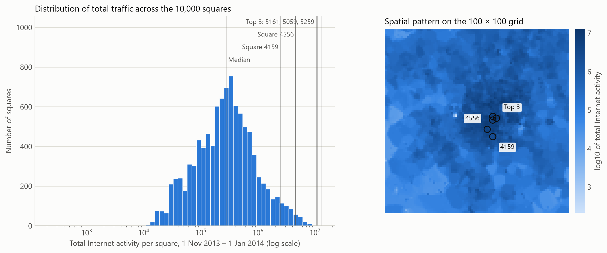
<figcaption><b>Fig. 2.</b> Left: total Internet activity per square over the whole period (log scale). Right: the same totals on the 100 × 100 grid, with the three busiest squares and squares 4159 and 4556 marked.</figcaption>
</figure>

### 4.2 Temporal dynamics of five squares

<!-- NOTE
Top 3: 5161 (rank 1), 5059 (2), 5259 (3). 4159 is rank 424, 4556 is rank 109.
First-two-weeks statistics (statistics.json -> temporal_profiles):
| square | weekend/weekday | peak hour | peak/trough | lag-144 ACF |
| 5161 | 1.26 | 16:00 | 17.3 | 0.91 |
| 5059 | 0.77 | 14:00 | 9.0  | 0.90 |
| 5259 | 0.34 | 13:00 | 7.9  | 0.71 |
| 4159 | 0.52 | 12:00 | 3.8  | 0.78 |
| 4556 | 1.11 | 22:00 | 4.1  | 0.79 |
Similarities: all share the daily cycle and a night-time trough around 04:00-06:00.
Differences / explanations to reason about:
- 5161 busier at weekends with a sharp afternoon peak -> leisure/shopping/tourist area.
- 5259 and 4159 collapse at weekends and on Fri 1 Nov (All Saints' Day, a public holiday)
  -> office/business districts. Note 1 Nov behaves like a Sunday.
- 4556 peaks late in the evening (22:00) and is higher at weekends -> nightlife/residential.
- Unusual: the 8,000 spike in 5161 on Sat 2 Nov; the isolated spike in 5059 on Sun 3 Nov.
  Possible event or measurement artefact; you can't tell which, so say so.
- Forecasting consequence: a weekday-only model will fail on 5161 weekends; the lag-144
  ACF is lower for 5259 because weekday != weekend, so "same time yesterday" is a
  poor guide on Mondays and Saturdays there (this shows up later in naive MAE on Mon 16
  and Sat 21: 1,382 and 1,089).
-->

[WRITE: similarities, differences, unusual behaviour and explanations, 2-3 paragraphs]

<figure>
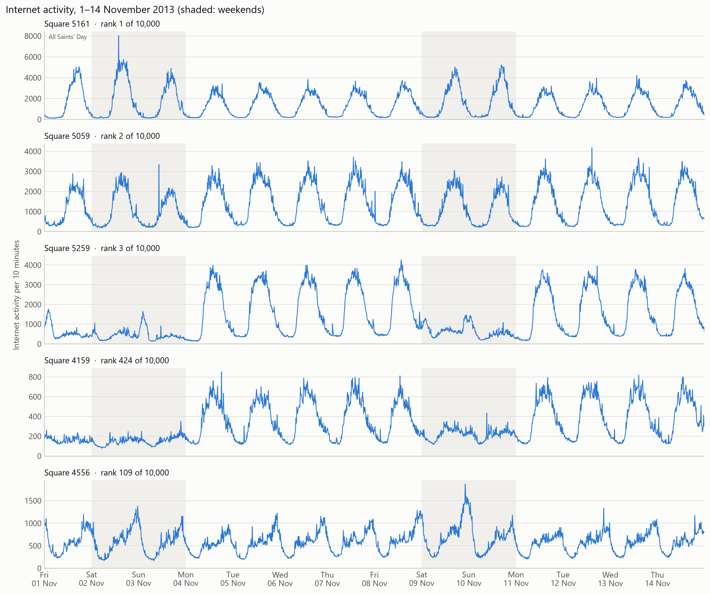
<figcaption><b>Fig. 3.</b> Internet activity for 1–14 November 2013 in the three busiest squares and squares 4159 and 4556. Weekends are shaded; 1 November is a public holiday.</figcaption>
</figure>

### 4.3 Analysis 1: autocorrelation and stationarity of square 5161

<!-- NOTE
Rubric: Time Series Analysis (12 pts): stationarity, autocorrelation, dependencies.
ACF (statistics.json -> busiest_square.acf):
  lag 1 = 0.99, lag 6 (1 h) = 0.94, lag 36 (6 h) = 0.01, lag 72 (12 h) = -0.68,
  lag 144 (1 day) = 0.88, lag 432 (3 days) = 0.74, lag 1008 (1 week) = 0.84,
  lag 2016 (2 weeks) = 0.70.  White-noise band +/-0.021.
  -> Strong short memory plus daily and weekly peaks; the weekly peak (0.84) is higher
  than the 3-day one (0.74), so there is a real weekly component.
PACF: 0.99 at lag 1, 0.26 at lag 2, then small -> an AR(2) core (this chose p = 2).
Stationarity (ADF and KPSS on log(1+x)):
  level: ADF -19.0 (p < 0.001), KPSS 0.24 (p > 0.1)
  first difference and daily seasonal difference: both tests agree on stationarity.
  Interpretation to explain carefully: the tests say "stationary around a fixed
  seasonal pattern", yet the decomposition shows a December trend and holiday shifts.
  ADF/KPSS have limited power against slow level shifts in such a long, strongly
  periodic series. That is why d = 1 was still tried in tuning, and it helped RMSE
  (fitted AR root 1.04 with d = 0 means near-unit-root errors).
Log transform: daily range correlates 0.92 with daily mean (multiplicative seasonality);
  after log, residual std ratio across hours drops from 17.0x to 1.9x.
-->

[WRITE: what the ACF/PACF and tests show, and what you decided from them, 2 paragraphs]

<figure>
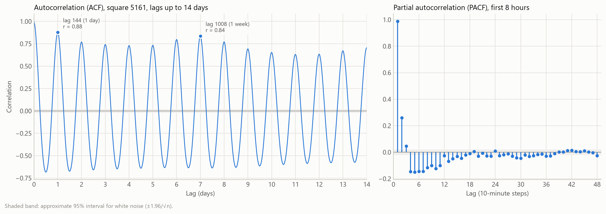
<figcaption><b>Fig. 4.</b> Autocorrelation and partial autocorrelation of log(1 + traffic) for square 5161.</figcaption>
</figure>

### 4.4 Analysis 2: seasonal decomposition and anomalies of square 5161

<!-- NOTE
MSTL [12] with periods 144 and 1008 on log(1+x), robust fitting.
Strengths: daily seasonality 0.95, weekly 0.45, trend 0.50.
Robust vs default (decomposition_experiment.json): the default fit absorbed part of the
  Christmas dip into the seasonal component (mean abs daily-seasonal difference is 0.18
  around Christmas vs 0.08 overall), which hid the anomaly. The robust fit keeps the
  seasonal shape clean and puts the dip in the residual (Christmas mean residual
  -0.81 vs -0.58). This is a good "technical decision" to mention in the video too.
Unusual days (|z| > 3.5 on mean daily residual):
  25 Dec (z = -14.2), 26 Dec (-8.7), 18 Dec (+7.2), 11 Dec (+3.5).
  18 Dec falls inside the test week -> expect it to be hard to forecast.
  11 and 18 Dec are both Wednesdays: possibly a recurring event; say you can't confirm.
Trend: falls from mid-December into Christmas (people leave the city).
Forecasting consequences: the daily cycle dominates -> Fourier terms / one-day windows;
  the weekly cycle is weaker but real -> weekly Fourier terms; the test week sits just
  before the holiday regime -> distribution shift risk.
-->

[WRITE: what the decomposition and anomalies show and how they informed the models, 2 paragraphs]

<figure>

<figcaption><b>Fig. 5.</b> Robust MSTL decomposition of log(1 + traffic) for square 5161 into trend, daily and weekly seasonality and residual, with the flagged unusual days.</figcaption>
</figure>

## 5. Methodology

### 5.1 Forecasting setup and data split

<!-- NOTE
- Task: one-step-ahead x_a(t+1) given the history up to t, for squares 5161, 5059, 5259.
- Chronological split: train 1 Nov - 8 Dec; validation 9 - 15 Dec; test 16 - 22 Dec
  (1,008 test steps per square). No shuffling across time, so nothing leaks from the future.
- The test week was touched once, after tuning finished.
- Rolling one-step evaluation: each forecast uses the true values up to t (not the
  model's own previous forecasts).
- Preprocessing (same for all models): y = log(1 + x) -> standardise with the training
  mean/std only -> model -> invert both. Justify from Section 4.3 (multiplicative swings).
- Metrics: MAE, RMSE, MAPE (brief); MASE [13] added because it is comparable across squares
  with very different volumes; MASE < 1 beats the in-sample seasonal-naive forecast.
-->

[WRITE: forecasting setup, split, preprocessing and metrics, 2 paragraphs]

### 5.2 Models

<!-- NOTE
Rubric: Model Design (14 pts). For EACH model give: structure, input representation
(sequence length), preprocessing/normalisation, training procedure, and why it fits the
EDA. Also the limitation you expect. Check the details against
src/milan_forecasting/forecasting/models/statistical.py and neural.py before writing.

Seasonal naive (baseline): x(t+1) = x(t+1-144). Justified by lag-144 ACF 0.88.

ARIMA-Fourier (dynamic harmonic regression [10]):
- log-standardised series = Fourier regressors + ARIMA(2,1,0) errors (order from the grid, Table 4).
- 16 daily Fourier pairs (period 144) + 8 weekly pairs (period 1008), with weekly
  harmonics 7 and 14 dropped because they equal daily harmonics 1 and 2 -> 14 weekly columns.
- Input representation: the whole history through the state-space filter; no fixed window.
- Fitted by maximum likelihood (statsmodels SARIMAX) on the training split only; at test
  time the fitted state is updated with each new observation (no refit).
- Why: captures multiple long seasonalities cheaply; PACF -> p = 2, confirmed by the grid.
- Limitation: seasonal shape is fixed (same every week), linear, can't adapt to holidays.

LSTM [8]:
- 1 layer, 64 hidden units, linear head on the last hidden state; 17,217 parameters.
- Input: sliding window of the last 144 steps (one day), 1 feature (log-standardised traffic).
- Adam, lr 5e-4, batch 128, MSE loss, up to 80 epochs, early stopping patience 10 on
  validation loss, best weights restored; seeds 42/7/123.
- Why: learns nonlinear dynamics; memory through gates.
- Limitation: sequential processing is slow on CPU; a one-day window can't see weekday vs weekend.

TCN [9]:
- 6 residual levels, kernel 3, dilations 1..32, 16 channels, dropout 0.1; receptive
  field 253 steps (> 144 window); 8,737 parameters.
- Same input window and preprocessing as the LSTM for a fair comparison.
- Adam, lr 1e-3, batch 128, up to 80 epochs, patience 6.
- Why: causal convolutions, fixed receptive field, parallel over time.
- Limitation: receptive field is fixed; sensitive to initialisation (seen later).
-->

[WRITE: baseline, 1-2 sentences]

[WRITE: ARIMA-Fourier: structure, inputs, training, why chosen, expected weakness]

[WRITE: LSTM: structure, inputs, training, why chosen, expected weakness]

[WRITE: TCN: structure, inputs, training, why chosen, expected weakness]

<b>Table 2.</b> Input representation and final settings of each model.

| Model | Input | Preprocessing | Key settings | Parameters |
|---|---|---|---|---:|
| Seasonal naive | value 144 steps back | none | lag 144 | 0 |
| ARIMA-Fourier | full history (state space) | log(1+x), train z-score | ARIMA(2,1,0); 16 daily + 8 weekly Fourier pairs | 49 |
| LSTM | last 144 steps, 1 feature | log(1+x), train z-score | 1 layer, 64 units; Adam 5e-4; patience 10 | 17,217 |
| TCN | last 144 steps, 1 feature | log(1+x), train z-score | 6 levels, 16 channels, kernel 3, dropout 0.1; Adam 1e-3; patience 6 | 8,737 |

### 5.3 Hyperparameter tuning strategy

<!-- NOTE
Rubric: Experimentation & Tuning (10 pts): iterative, documented, justified.
- Manual, one change per run, all on the validation week of 5161, with the reason
  written into the log before each run (results/3_hyperparameter_tuning/experiment_log.csv).
- Stopping rule: stop tuning a model once a change improves validation MAE by < 1%.
- Why no full grid search for the networks: one LSTM run with a week-long window took 63 min
  on 2 CPU cores; a grid of even 3x3x3 settings would take days. ARIMA fits take under
  two minutes, so a 3x3 grid over p and q was affordable (Table 4) and was used to check
  the manual choice. One-at-a-time runs let each result
  guide the next change (as the brief asks). Admit the downside: interactions between
  settings are not explored, and using a single seed while tuning adds noise.
- Walk through the story of Table 3, e.g.:
  * ARIMA: 8->16 daily pairs helped a little; 4->8 weekly pairs *failed* (MAE 1,061,
    optimiser did 0 iterations) because harmonic 7 of a 1008-period wave equals harmonic 1
    of a 144-period wave -> collinear regressors; fixed by dropping duplicates (A2b).
    d = 1 because the d = 0 fit had an AR root at 1.04. A4 ended the manual search; the grid (Table 4) then dropped the MA term.
  * LSTM: a week-long window gained only 3% MAE for 28x the time, so it was reverted;
    a lower learning rate barely mattered; two layers made it worse -> small data
    (~5.3k windows) favours a small model.
  * TCN: halving channels made it *better* and 30% faster; more epochs changed nothing
    (early stopping ended at the same epoch); a week-long window with 8 levels did not
    help and cost 4x the time.
-->

[WRITE: tuning strategy and the reasoning chain across runs, 2-3 paragraphs]

<b>Table 3.</b> Tuning log on the validation week (9–15 Dec) of square 5161, in the order the runs were made. One setting changed per run; bold rows are the chosen network configurations (the final ARIMA order comes from Table 4).

<table class="log">
<thead><tr><th>Run</th><th>Model</th><th>Change from previous run of this model</th><th>MAE</th><th>RMSE</th><th>Train (s)</th></tr></thead>
<tbody>
<tr><td>N0</td><td>Naive</td><td>same time yesterday</td><td>294.9</td><td>525.5</td><td>0</td></tr>
<tr><td>A0</td><td>ARIMA</td><td>start: ARMA(2,1), 8 daily + 4 weekly pairs</td><td>101.8</td><td>156.5</td><td>61</td></tr>
<tr><td>L0</td><td>LSTM</td><td>start: window 144, 64 units, lr 1e-3</td><td>112.6</td><td>172.9</td><td>136</td></tr>
<tr><td>T0</td><td>TCN</td><td>start: window 144, 6 levels, 32 channels</td><td>105.3</td><td>160.5</td><td>431</td></tr>
<tr><td>A1</td><td>ARIMA</td><td>daily pairs 8 → 16</td><td>101.0</td><td>155.2</td><td>97</td></tr>
<tr><td>L1</td><td>LSTM</td><td>window 144 → 1008</td><td>109.5</td><td>166.7</td><td>3,792</td></tr>
<tr><td><b>T1</b></td><td><b>TCN</b></td><td><b>channels 32 → 16</b></td><td><b>100.7</b></td><td><b>154.4</b></td><td><b>300</b></td></tr>
<tr><td>A2</td><td>ARIMA</td><td>weekly pairs 4 → 8 (failed: collinear regressors)</td><td>1,061.1</td><td>1,521.5</td><td>22</td></tr>
<tr><td><b>L2</b></td><td><b>LSTM</b></td><td><b>window back to 144; lr 5e-4, patience 10, 80 epochs</b></td><td><b>109.7</b></td><td><b>168.2</b></td><td><b>135</b></td></tr>
<tr><td>T2</td><td>TCN</td><td>max epochs 40 → 80 (stopped at the same epoch)</td><td>100.7</td><td>154.4</td><td>493</td></tr>
<tr><td>A2b</td><td>ARIMA</td><td>A2 with duplicate weekly harmonics removed</td><td>100.3</td><td>155.9</td><td>283</td></tr>
<tr><td>A3</td><td>ARIMA</td><td>A1 with d 0 → 1</td><td>100.7</td><td>152.2</td><td>72</td></tr>
<tr><td>A4</td><td>ARIMA</td><td>d = 1 and 8 weekly pairs (A2b + A3); refined by the grid (Table 4)</td><td>100.1</td><td>153.3</td><td>36</td></tr>
<tr><td>L3</td><td>LSTM</td><td>1 → 2 layers, dropout 0.1</td><td>113.8</td><td>174.9</td><td>365</td></tr>
<tr><td>T3</td><td>TCN</td><td>window 144 → 1008, 8 levels</td><td>103.1</td><td>155.6</td><td>1,234</td></tr>
</tbody>
</table>

<!-- NOTE
Grid search (Table 4): `05_tuning_experiment.py --grid`, 9 runs, final Fourier terms and d = 1 fixed.
- (2,1,1) reproduced run A4 exactly (MAE 100.13), confirming the fit is deterministic.
- Validation MAE is lowest for (2,1,0): 96.6, 3.5% better than the manual (2,1,1).
  By the study's own >1% rule, (2,1,0) was adopted as the final ARIMA.
- BE TRANSPARENT ABOUT TIMING: the switch happened after the first test-week evaluation
  with (2,1,1) had already been run and seen (MAE 83.79 / 66.56 / 62.91; ARIMA vs TCN not
  significant). The choice used only validation data, but a reader should know both
  results exist. Report both, e.g. in a sentence or a small table in Section 6.1.
  The first run is archived in results/4_model_evaluation/first_run_arima_211/.
- AIC ranking: (1,1,2) -6126, (2,1,2) -6124, (0,1,2) -6117, (2,1,1) -6116; (2,1,0) is only 7th of 9 (-5937).
- So in-sample fit (AIC) and out-of-sample error disagree. Discuss why: AIC rewards fitting
  the training weeks; the validation week is a single week, so a 3.5% gap may be noise
  (no significance test was run on validation).
- p = q = 0 (Fourier terms plus a random walk, no ARMA terms) gives MAE 105.5, the worst,
  showing the ARMA error terms matter.
- Admit the manual search stopped early: its own 1% rule would have continued, because
  dropping the MA term was never tried by hand.
-->

<b>Table 4.</b> Grid search over the ARIMA orders p and q on the validation week of square 5161 (d = 1, 16 daily and 8 weekly Fourier pairs). (2,1,1) was the manual choice; the bold row, (2,1,0), is the final order. AIC is from the training fit.

| p | q | MAE | RMSE | MAPE (%) | AIC | Train (s) |
|---:|---:|---:|---:|---:|---:|---:|
| 0 | 0 | 105.5 | 159.5 | 8.54 | −4,591 | 38 |
| 0 | 1 | 99.4 | 152.9 | 7.70 | −6,079 | 36 |
| 0 | 2 | 100.3 | 153.6 | 7.78 | −6,117 | 44 |
| 1 | 0 | 98.7 | 150.9 | 7.87 | −5,455 | 4 |
| 1 | 1 | 100.2 | 153.7 | 7.77 | −6,113 | 28 |
| 1 | 2 | 100.0 | 153.0 | 7.75 | −6,126 | 21 |
| **2** | **0** | **96.6** | **147.6** | **7.53** | **−5,937** | **15** |
| 2 | 1 | 100.1 | 153.3 | 7.76 | −6,116 | 41 |
| 2 | 2 | 100.0 | 153.0 | 7.75 | −6,124 | 97 |

### 5.4 Final evaluation protocol

<!-- NOTE
- Each network trained with seeds 42, 7, 123 on each square -> mean ± std.
- ARIMA and naive are deterministic; ARIMA timing repeated 3 times per square.
- Timing: time.perf_counter wall clock; training = fit (networks: all epochs incl. early
  stopping); prediction = all 1,008 test forecasts, reported per step. Median and
  min-max over 9 measurements across the 3 squares (timing.json). Hardware in Table 9.
- torch limited to 2 threads (physical cores).
-->

[WRITE: evaluation protocol and timing method, 1 paragraph]

## 6. Results and Discussion

### 6.1 Predictive performance

<!-- NOTE
Rubric: Evaluation & Comparison (13 pts). The brief asks for three tables (one per square).
Points to interpret:
- All three models beat seasonal naive by a wide margin (MASE 0.12-0.27 vs 0.64-0.98).
- ARIMA-Fourier (2,1,0) has the best mean MAE, MAPE, RMSE and MASE in every square.
- The gaps are small (4-10% MAE). Are they bigger than the seed spread? For 5161, LSTM
  92.5 ± 1.9 vs ARIMA 76.9: yes. For TCN on 5259, 68.9 ± 9.8: the spread is larger than the
  gap, so TCN is *unreliable* rather than clearly worse.
- Significance (Table 8, scripts/08_significance_tests.py): Diebold-Mariano tests on the
  1,008 test forecasts (networks: seed 42). Absolute loss: ARIMA beats both networks
  significantly on 5161 (p < 0.001) and 5059 (LSTM p = 0.034, TCN p < 0.001), and the LSTM
  on 5259 (p = 0.023), but ARIMA vs TCN on 5259 is NOT significant (p = 0.60).
  So: "ARIMA is significantly better in 5 of 6 comparisons, and level with the TCN in the
  office-like square 5259." Relate that to the data: 5259 has flat weekends and a
  very regular weekday shape, which is easy for all models (lowest MASE of all squares).
  Caveat: the test uses one seed per network.
- With the manual (2,1,1), none of the ARIMA-vs-TCN tests were significant. The change of
  a single MA term moved the conclusion, which is itself a finding: say how fragile the
  ranking is.
- Validation vs test (5161): ARIMA MAE 96.6 -> 76.9, TCN 100.7 -> 87.7, LSTM 109.7 -> 92.5.
  MAE improves for all because the test week is calmer (mean traffic 1,445 vs 1,697, mean
  10-minute move 93 vs 117), but MAPE, which removes the level
  effect, gets worse for both networks (LSTM 8.06 -> 8.48, TCN 7.58 -> 8.60) and better for
  ARIMA (7.53 -> 7.33). The networks were early-stopped on the validation week, so their
  validation scores flattered them slightly. Possible reason: the neural nets were tuned on one seed and a
  single week (overfitting to the validation week); ARIMA has 49 parameters.
- Across squares: MAPE is similar (6-9%), but naive MAPE for 5259 is 71.6%. Why?
  Mon 16 and Sat 21 are weekday/weekend switches in an office district (naive MAE 1,382
  and 1,089 on those days). The trained models don't suffer that because they see the
  weekly pattern (ARIMA) or the last day (networks).
- 5259: all models do *better* on the weekend (weekend/weekday MAE 0.55-0.60), since
  flat, low traffic is easy. 5161: ARIMA is 1.39x worse at weekends vs 1.22-1.25x for the
  networks -> the fixed weekly Fourier shape underestimates the unusually high
  pre-Christmas weekend peak; the networks adapt from the last day.
- Link back to research: consistent with Azari et al. [6] (ARIMA competitive at this
  granularity) and Zeng et al. [11] (simple beats complex when structure is
  mostly seasonal).
-->

[WRITE: results interpretation, 3-4 paragraphs]

<b>Table 5.</b> Test-week (16–22 Dec) results, square 5161 (busiest). Networks: mean ± standard deviation over three seeds.

| Model | MAE | MAPE (%) | RMSE | MASE |
|---|---:|---:|---:|---:|
| Seasonal naive | 338.59 | 25.94 | 619.04 | 0.975 |
| **ARIMA-Fourier** | **76.86** | **7.33** | **117.12** | **0.221** |
| LSTM | 92.53 ± 1.94 | 8.48 ± 0.04 | 144.31 ± 3.12 | 0.266 ± 0.006 |
| TCN | 87.74 ± 0.69 | 8.60 ± 0.63 | 132.10 ± 3.52 | 0.253 ± 0.002 |

<b>Table 6.</b> Test-week results, square 5059.

| Model | MAE | MAPE (%) | RMSE | MASE |
|---|---:|---:|---:|---:|
| Seasonal naive | 171.74 | 18.02 | 245.87 | 0.635 |
| **ARIMA-Fourier** | **63.86** | **6.11** | **93.33** | **0.236** |
| LSTM | 69.58 ± 2.41 | 6.72 ± 0.24 | 102.17 ± 3.76 | 0.257 ± 0.009 |
| TCN | 73.31 ± 4.75 | 7.50 ± 0.99 | 104.32 ± 4.68 | 0.271 ± 0.018 |

<b>Table 7.</b> Test-week results, square 5259.

| Model | MAE | MAPE (%) | RMSE | MASE |
|---|---:|---:|---:|---:|
| Seasonal naive | 470.32 | 71.62 | 861.62 | 0.898 |
| **ARIMA-Fourier** | **63.20** | **6.83** | **92.70** | **0.121** |
| LSTM | 66.63 ± 0.33 | 7.24 ± 0.11 | 96.00 ± 1.44 | 0.127 ± 0.001 |
| TCN | 68.86 ± 9.80 | 7.24 ± 0.39 | 103.54 ± 20.31 | 0.131 ± 0.019 |

<b>Table 8.</b> Diebold–Mariano tests on the 1,008 test-week forecasts of each square (networks: seed 42). A negative statistic means model A has the lower loss. Newey–West variance with lag 6 and the Harvey–Leybourne–Newbold adjustment [18], [19]. * p < 0.05, ** p < 0.01, *** p < 0.001.

| Square | A vs B | DM (absolute) | p | DM (squared) | p |
|---|---|---:|---:|---:|---:|
| 5161 | ARIMA vs LSTM | −4.76*** | <0.001 | −4.23*** | <0.001 |
| 5161 | ARIMA vs TCN | −4.35*** | <0.001 | −3.81*** | <0.001 |
| 5161 | LSTM vs TCN | 1.99* | 0.047 | 2.70** | 0.007 |
| 5059 | ARIMA vs LSTM | −2.12* | 0.034 | −2.04* | 0.041 |
| 5059 | ARIMA vs TCN | −3.76*** | <0.001 | −2.96** | 0.003 |
| 5059 | LSTM vs TCN | −1.43 | 0.152 | −0.63 | 0.529 |
| 5259 | ARIMA vs LSTM | −2.28* | 0.023 | −1.80 | 0.072 |
| 5259 | ARIMA vs TCN | 0.53 | 0.598 | 0.78 | 0.433 |
| 5259 | LSTM vs TCN | 3.04** | 0.002 | 3.11** | 0.002 |

<figure>

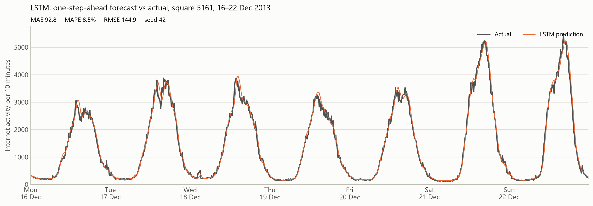
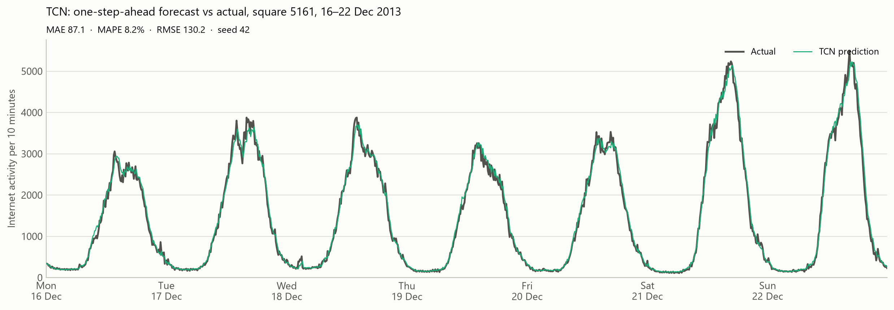
<figcaption><b>Fig. 6.</b> Actual and one-step-ahead predicted traffic for square 5161, 16–22 December 2013 (networks: seed 42). The corresponding plots for squares 5059 and 5259 are in Appendix A.</figcaption>
</figure>

<figure>
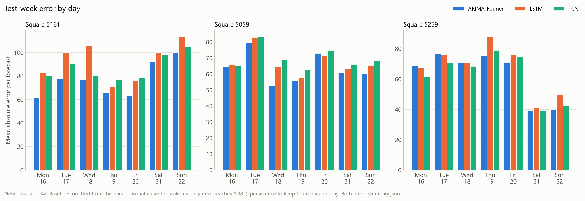
<figcaption><b>Fig. 7.</b> Mean absolute error per day of the test week for each square and model.</figcaption>
</figure>

### 6.2 Computational cost

<!-- NOTE
- ARIMA trains ~10x faster than the networks (19 s vs 190-222 s median). Dropping the MA
  term also made the fit faster than the manual (2,1,1), which took 53 s.
- All models predict in < 0.2 ms per step, so for a real 10-minute deployment only
  training/retraining cost matters.
- TCN's wide range (129-497 s) is partly laptop noise (thermal throttling, background
  load): an identical run took 300 s once and 493 s another time. That's why medians are reported.
- Trade-off: on a GPU the TCN would parallelise far better than the LSTM; on this 2-core CPU it did not.
- Scaling: 10,000 squares x 19 s = ~2 days for ARIMA per retrain on this laptop; a global
  network trained across squares could be cheaper per square. Good discussion point.
-->

<b>Table 9.</b> Training and prediction time. Median (min–max) over nine measurements across the three squares; the ARIMA timings were re-measured on the same laptop after the grid search. Hardware: Intel Core i5-7200U (2 cores, 4 threads), 15.8 GiB RAM, no GPU, Windows 10, Python 3.14, PyTorch 2.14 (CPU, 2 threads), statsmodels 0.15.

| Model | Training time (s) | Prediction time per step (ms) |
|---|---:|---:|
| Seasonal naive | 0 | < 0.01 |
| ARIMA-Fourier | 18.6 (12.1–25.5) | 0.12 (0.11–0.14) |
| LSTM | 189.9 (111.6–282.2) | 0.19 (0.14–0.43) |
| TCN | 222.1 (128.8–496.6) | 0.14 (0.12–0.39) |

[WRITE: computational comparison and what it means in practice, 1-2 paragraphs]

### 6.3 Failure analysis

<!-- NOTE
Rubric: Failure Analysis (8 pts). failure_analysis/summary.json
- Poorest period: 5161, Sat 21 - Sun 22 Dec (ARIMA daily MAE 92 and 100 vs 61-78 on weekdays).
  Afternoon peaks ~5,200-5,500, about 50% above the weekday peaks (~3,500).
  Largest ARIMA miss: Sat 13:20, actual 3,381 after 3,720, ARIMA 4,017 (error 636);
  LSTM 3,873 and TCN 3,853 also overshoot.
- Pattern across everything: 94-100% of the largest 5% of errors are *under-reactions*,
  where the forecast moves less than the real 10-minute jump, for every model and square.
  Correlation between |error| and |actual move| is 0.58-0.74.
  -> The models behave like smoothed persistence plus seasonality; a sudden 10% dip within
  10 minutes is not predictable from history alone (it is noise or an external event).
- ARIMA overshoots more on the weekend because its weekly Fourier shape was learned
  from November weekends, which were lower than the pre-Christmas shopping weekend
  (regime shift, see trend in Fig. 5). The networks only look back one day, so Saturday's
  forecast is anchored to Friday; they are less affected by the weekly template but
  still under-react.
- 5059 Fri 20 23:40: a jump from 739 to 1,177 at night (event? nightlife?), which all
  models miss (forecasts 530-589).
- 18 Dec (flagged anomaly in Section 4.4) → check error_by_day: ARIMA 77.1 on 5161,
  not extreme, so the anomaly was partly predictable from the recent level.
- What could help: exogenous calendar/holiday/event features; neighbouring squares
  (spatial models [3], [4]); probabilistic forecasts that express uncertainty for sharp
  moves; retraining on recent weeks.
-->

[WRITE: failure case, why it happens, what would fix it, 2-3 paragraphs]

<figure>

<figcaption><b>Fig. 8.</b> The weakest period for square 5161: the last weekend before Christmas. The lower panel enlarges 11:20–15:20 on Saturday, where all three models overshoot a sudden dip.</figcaption>
</figure>

<figure>
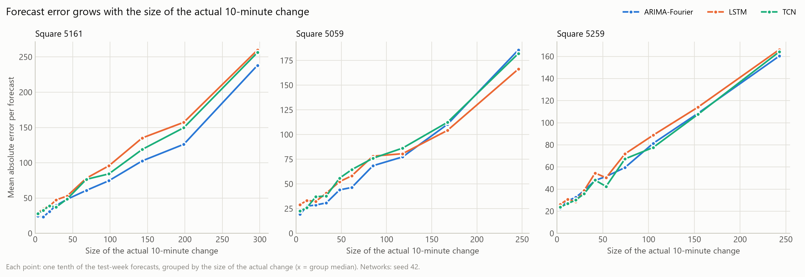
<figcaption><b>Fig. 9.</b> Mean absolute error against the size of the actual 10-minute change, per square and model.</figcaption>
</figure>

### 6.4 Comparative discussion

<!-- NOTE
Rubric asks: best model supported by numbers AND by reasoning from the EDA.
Tie together:
- Data = strong, stable daily + weekly seasonality (strengths 0.95/0.45) + short AR
  memory (PACF lag 1-2) + multiplicative scale handled by log. That is exactly the
  structure ARIMA-Fourier encodes explicitly, with 49 parameters.
- Networks must *learn* this from ~5,300 windows; with a one-day window they can't see the
  weekly cycle, and longer windows cost a lot without gain on this CPU.
- Suitability: ARIMA is best for accuracy, cost and interpretability here; the TCN is
  close but unstable across seeds; the LSTM is stable but consistently a bit worse.
- When might the ranking flip? Longer data (years), multi-step horizons, spatial inputs,
  GPU budget, irregular event-driven squares.
- Personal considerations and margins for improvement for EACH model (brief item V).
-->

[WRITE: comparative discussion and personal reflections on each model, 2-3 paragraphs]

## 7. Conclusion and Future Work

<!-- NOTE
- Answer the research question directly, in 2-3 sentences.
- How performance varied across areas (5259 easiest by MASE; the naive baseline is
  weakest in office districts; weekend-heavy 5161 is hardest for ARIMA at weekends).
- Limitations: 3 squares only; one test week just before Christmas; all tuning on one
  square (5161) with one seed, so the chosen settings may suit 5161 best; the networks see
  only the last 144 steps and no calendar features, so they cannot tell a Monday from a
  Saturday (a likely reason they trail ARIMA, which has the weekly Fourier terms);
  significance tests use one seed per network; univariate; no exogenous data; laptop timing noise; point forecasts only.
- Future work: spatial-temporal models [3], [4]; holiday/event covariates; a global
  model across many squares; multi-step horizons; prediction intervals; more seeds and
  a proper hyperparameter search (e.g. Optuna) with a GPU.
-->

[WRITE: conclusion, limitations and future work, 2 paragraphs]

## Declaration of AI Use

<!-- NOTE
The brief requires this. Be specific and honest: which tool, for what (e.g. help with
code structure, debugging, plotting, checking references, building the PDF pipeline),
what you did yourself, and that you checked and can explain every result.
-->

[WRITE: AI-use disclosure]

## References

[1] G. Barlacchi *et al.*, "A multi-source dataset of urban life in the city of Milan and the Province of Trentino," *Scientific Data*, vol. 2, Art. no. 150055, 2015, doi: 10.1038/sdata.2015.55.

[2] Telecom Italia, "Telecommunications – SMS, Call, Internet – MI," Harvard Dataverse, 2015, doi: 10.7910/DVN/EGZHFV.

[3] C. Zhang and P. Patras, "Long-term mobile traffic forecasting using deep spatio-temporal neural networks," in *Proc. ACM Int. Symp. Mobile Ad Hoc Networking and Computing (MobiHoc)*, 2018, pp. 231–240, doi: 10.1145/3209582.3209606.

[4] C. Zhang, H. Zhang, D. Yuan, and M. Zhang, "Citywide cellular traffic prediction based on densely connected convolutional neural networks," *IEEE Commun. Lett.*, vol. 22, no. 8, pp. 1656–1659, 2018, doi: 10.1109/LCOMM.2018.2841832.

[5] J. Wang *et al.*, "Spatiotemporal modeling and prediction in cellular networks: A big data enabled deep learning approach," in *Proc. IEEE INFOCOM*, 2017, doi: 10.1109/INFOCOM.2017.8057090.

[6] A. Azari, P. Papapetrou, S. Denic, and G. Peters, "Cellular traffic prediction and classification: A comparative evaluation of LSTM and ARIMA," in *Discovery Science (DS 2019)*, Lecture Notes in Computer Science, vol. 11828, Springer, 2019, doi: 10.1007/978-3-030-33778-0_11.

[7] H. D. Trinh, L. Giupponi, and P. Dini, "Mobile traffic prediction from raw data using LSTM networks," in *Proc. IEEE 29th Annu. Int. Symp. Personal, Indoor and Mobile Radio Communications (PIMRC)*, 2018, pp. 1827–1832, doi: 10.1109/PIMRC.2018.8581000.

[8] S. Hochreiter and J. Schmidhuber, "Long short-term memory," *Neural Computation*, vol. 9, no. 8, pp. 1735–1780, 1997.

[9] S. Bai, J. Z. Kolter, and V. Koltun, "An empirical evaluation of generic convolutional and recurrent networks for sequence modeling," arXiv:1803.01271, 2018.

[10] R. J. Hyndman and G. Athanasopoulos, *Forecasting: Principles and Practice*, 3rd ed. Melbourne, Australia: OTexts, 2021. [Online]. Available: https://otexts.com/fpp3/

[11] A. Zeng, M. Chen, L. Zhang, and Q. Xu, "Are Transformers effective for time series forecasting?" in *Proc. AAAI Conf. Artificial Intelligence*, vol. 37, no. 9, 2023, arXiv:2205.13504.

[12] K. Bandara, R. J. Hyndman, and C. Bergmeir, "MSTL: A seasonal-trend decomposition algorithm for time series with multiple seasonal patterns," arXiv:2107.13462, 2021.

[13] R. J. Hyndman and A. B. Koehler, "Another look at measures of forecast accuracy," *Int. J. Forecasting*, vol. 22, no. 4, pp. 679–688, 2006.

[14] pandas development team, "Scaling to large datasets," pandas documentation. [Online]. Available: https://pandas.pydata.org/docs/user_guide/scale.html

[15] NumPy developers, "numpy.memmap," NumPy documentation. [Online]. Available: https://numpy.org/doc/stable/reference/generated/numpy.memmap.html

[16] Source code repository. [Online]. Available: https://github.com/allia-wase/milan-traffic-forecasting

[17] Video presentation. [Online]. Available: [WRITE: video link]

[18] F. X. Diebold and R. S. Mariano, "Comparing predictive accuracy," *J. Business & Economic Statistics*, vol. 13, no. 3, pp. 253–263, 1995.

[19] D. Harvey, S. Leybourne, and P. Newbold, "Testing the equality of prediction mean squared errors," *Int. J. Forecasting*, vol. 13, no. 2, pp. 281–291, 1997.

## Appendix A. Test-week forecasts for squares 5059 and 5259

<figure>
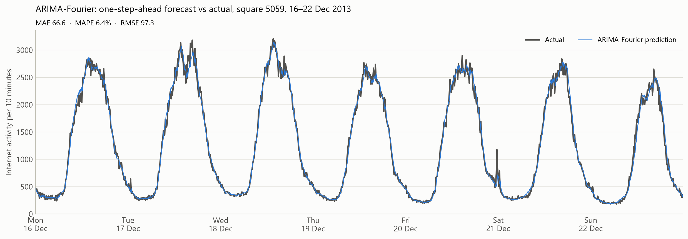
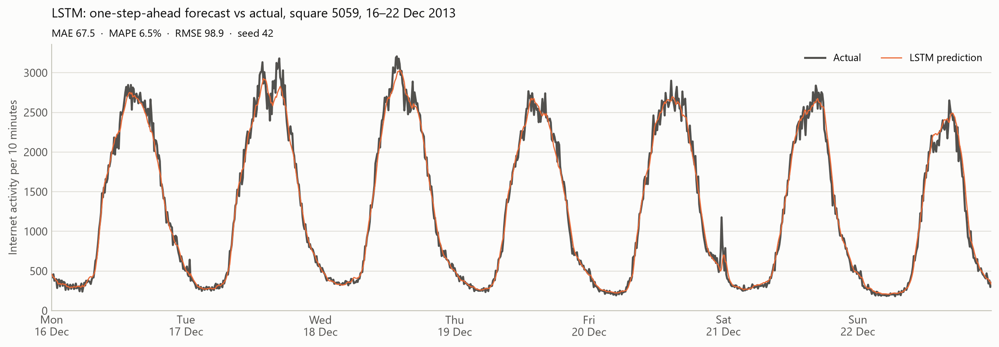
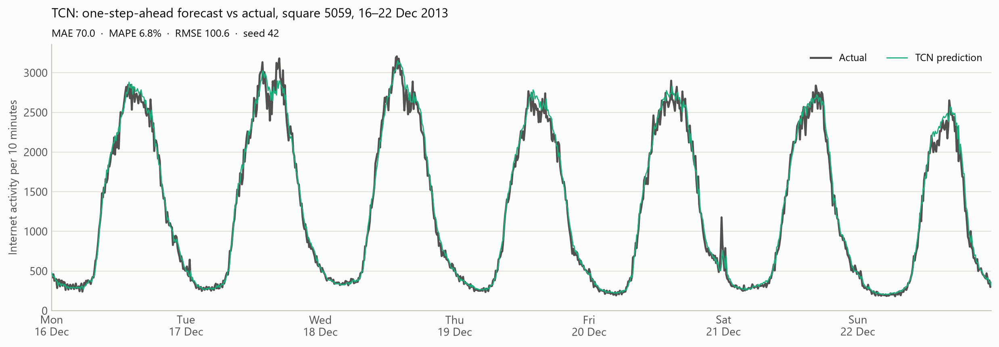
<figcaption><b>Fig. A1.</b> Actual and predicted traffic for square 5059, 16–22 December 2013.</figcaption>
</figure>

<figure>
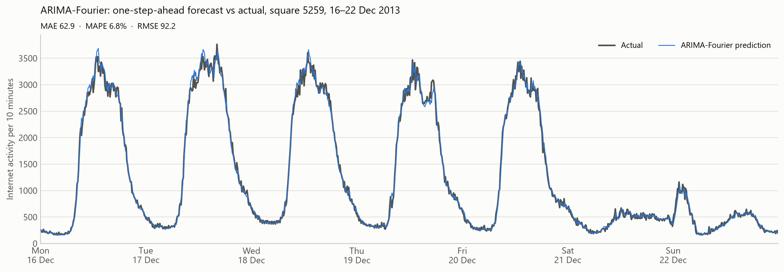
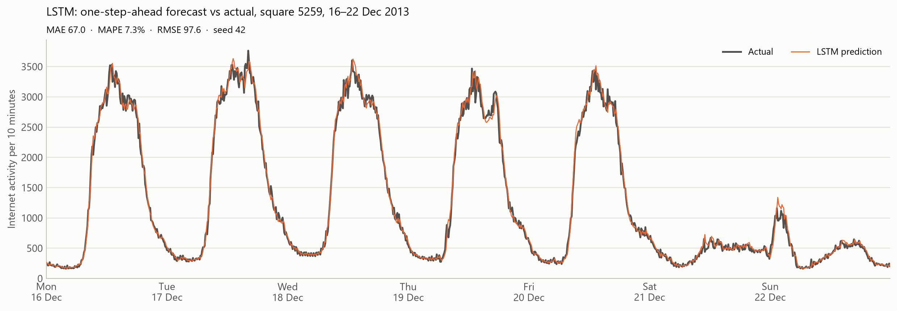
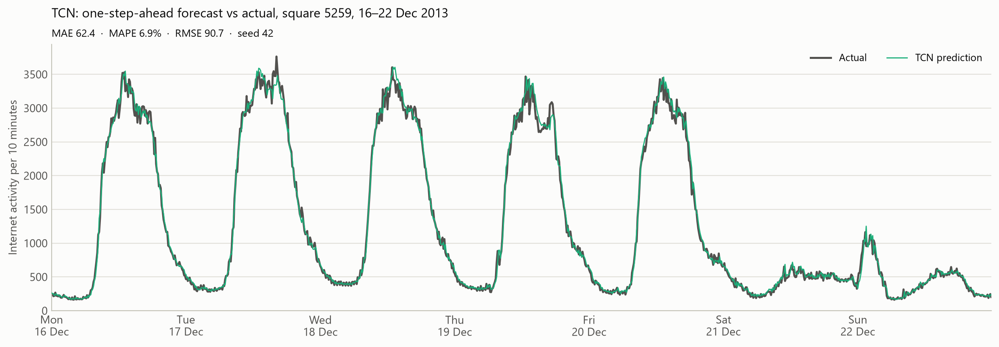
<figcaption><b>Fig. A2.</b> Actual and predicted traffic for square 5259, 16–22 December 2013.</figcaption>
</figure>
